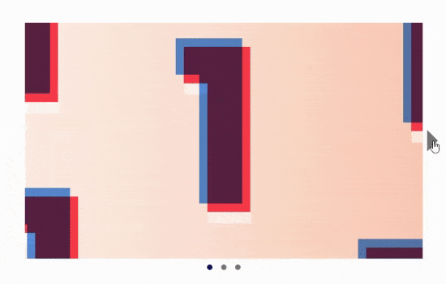

# Carousel Component Project
## Overview
The Carousel Component is a versatile and user-friendly slideshow component that allows you to showcase multiple items or images in an interactive and engaging manner. It features arrow buttons on the sides for sliding through the carousel and dotted buttons at the bottom for quick navigation to specific slides.

## Features
- **Slide Navigation:** The Carousel Component allows users to navigate through the slides using the left and right arrow buttons. When the slide is at the first position, the left arrow becomes hidden, and when the slide is at the last position, the right arrow becomes hidden, providing a seamless scrolling experience.

- **Dotted Button Navigation:** The Carousel Component also provides dotted buttons at the bottom, representing each slide. Users can click on these buttons to quickly jump to a specific slide, enhancing the user's control and navigation experience.

- **Responsive Design:** The Carousel Component is designed to be responsive, ensuring that it adapts to different screen sizes and devices. It will provide an optimal viewing experience across desktops, tablets, and mobile devices.

> [Live Demo Link](https://fmanimashaun.github.io/carousel-component//)

## Demo

## Installation
To install and run this project locally, you'll need to have Node.js and npm installed. Follow these steps:

Clone the repository: `git clone https://github.com/fmanimashaun/carousel-component.git
Navigate to the project folder: `cd carousel-component`
Install the dependencies: `npm install`
Start the project: `npm start`

## Author

👤 **Engr. Animashaun Fisayo**

- [GitHub](https://github.com/fmanimashaun)
- [Twitter](https://twitter.com/fmanimashaun)
- [LinkedIn](https://www.linkedin.com/in/fmanimashaun/)
- [Website](https://fmanimashaun.com)
## Contributing
We welcome contributions from the community. If you'd like to contribute, please fork the repository and make your changes, then open a pull request to propose your changes.

## License
This project is licensed under the MIT License. See the LICENSE file for details.